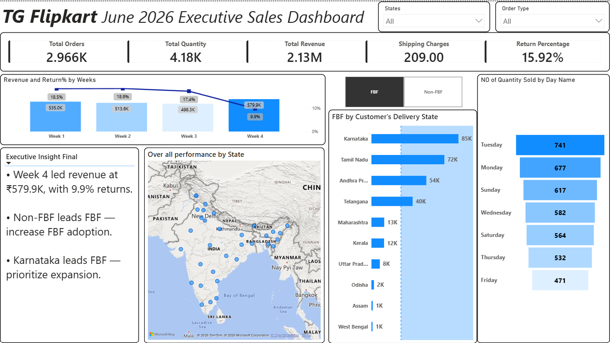

---

## 📊 Power BI Dashboard

An interactive Power BI dashboard was developed to provide an executive-level view of Flipkart sales and operational performance for June 2026.

### 1. Executive Sales Overview

The Executive Overview provides a consolidated view of:

- Total Orders
- Total Quantity
- Total Revenue
- Total Discount
- Average Selling Price
- Daily Revenue & Quantity Trends
- Weekday vs Weekend Order Performance
- FBF vs Non-FBF Revenue
- State-wise Returns & Return Rate
- Revenue Contribution by SKU


### 2. Operational & Return Analysis

This page focuses on operational performance, fulfilment and return behavior across different markets.

Key analysis includes:

- Weekly Revenue & Return Percentage
- FBF Performance by Delivery State
- Quantity Sold by Day
- State-level Performance
- Fulfilment Analysis
- Executive Business Insights



---

## 💡 Key Business Insights

- Week 4 generated the highest weekly revenue at approximately **₹579.9K**, while recording a return percentage of approximately **9.9%**.
- **Non-FBF contributed the larger share of revenue** compared with FBF during the analyzed period.
- **Karnataka recorded the highest FBF quantity** among the states highlighted in the dashboard.
- Return rates varied considerably across states, indicating differences in return behavior across geographic markets.
- Revenue was concentrated among a small number of SKUs, highlighting the importance of monitoring high-contribution products.
- Daily and weekly trends were analyzed to identify changes in sales performance throughout June 2026.

---

## 📁 Repository Structure

```text
flipkart-ecommerce-sales-analysis/
│
├── FK_sales_analysis.sql
├── flipkart_sales_analysis.ipynb
├── README.md
│
└── PowerBI/
    ├── FK_June_2026_Sales_Dashboard.pbix
    │
    └── Screenshots/
        ├── executive_overview.png
        └── operational_analysis.png
